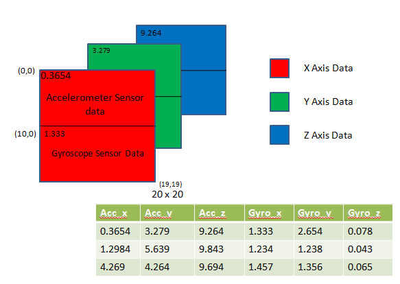

# Human-Activity-Recognition-using-Mobile-Sensors-Data

Human Actvity Recognition using mobile Sensors data is a research based project to build a model/system using RCNN-LSTM to detect realtime human activity using mobile's motion sensors data like Accelerometer and Gyroscope.
### Our Machine Learning Model
## On Device "Offline" Human Activity Detection Model...               
#### Sensors Data to Image
If the 3-axes of the human motion model are considered as the 3 channels of a RGB image, the value of the XYZ axial data can be mapped into the value of the RGB channel data in a RGB image respectively. Namely, each 3-axial data can be converted into an RGB pixel. The 400 pieces of 3-axial data cached in the sliding window can be viewed as a bitmap with size of 20 or 20 pixels.    
 

#### Requirements
- python3
- tensorflow: >=2.0.0    
- numpy     
- pandas     
- matplotlib

#### Dataset
- 1.MobiFall＆MobiAct DataSet
http://www.bmi.teicrete.gr/index.php/research/mobiact

- 2.SisFall http://sistemic.udea.edu.co/en/investigacion/proyectos/english-falls/

#### Sensors Data graph
          
            
           
               

#### Accuracy
Max Training Accuracy: 92.405%             
Max Testing Accuracy: 96.94%

<!-- ### Languages and Tools:

 

### Connect with us:

  -->
